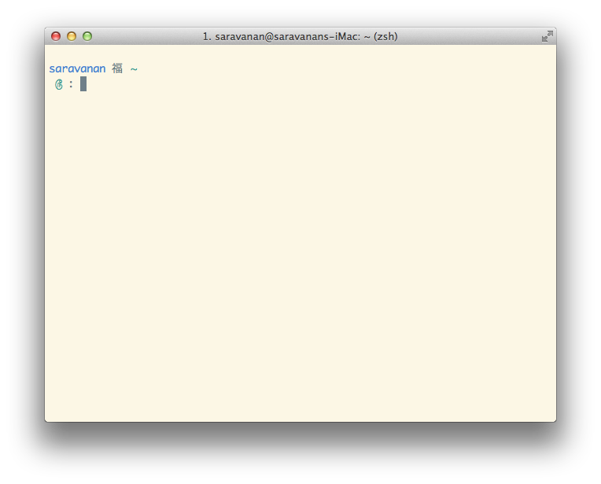

MyDotfile
=========

* It's a simple and basic .
* You Need to install [oh-my-zsh](https://github.com/robbyrussell/oh-my-zsh "oh-my-zsh") framework.
* _Credits to:_ [robbyrussell](https://github.com/robbyrussell) and the [contributors](https://github.com/robbyrussell/oh-my-zsh/graphs/contributors).

* Clone The Repository.
* copy saravan.zsh-theme or saravanan.zsh-theme to theme folder.
* `cp themes/saravan.zsh-theme  ~/.oh-my-zsh/themes/saravan.zsh-theme `
* or
* `cp themes/saravan.zsh-theme  ~/.oh-my-zsh/themes/saravanan.zsh-theme `

* To use: Set `ZSH_THEME` in `~/.zshrc` to `saravan` or `saravanan`.
* _To get large apple icon,change non-ASCII font-size
in iTerm --> Preference --> Profiles --> Text._ 

